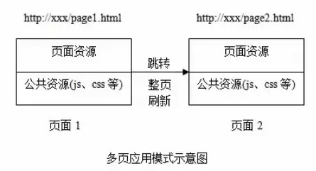

# js学习笔记
## 1. js运行机制
* 参考文章：
1. [https://juejin.im/post/5eb4fb615188256d8e65578f](url)
2. [https://juejin.im/post/5b498d245188251b193d4059](url)
### js为什么是单线程，为什么不是多线程呢
这与它的用途有关，js的主要用途是与用户交互以及处理DOM，这决定了它只能是单线程，不能是多线程。假设开了两个线程，一个线程处理在DOM节点上添加内容，另外一个线程处理删除这个节点，这时，浏览器就不知道到底是删除还是添加了，所以必须是单线程。
### js运行机制
单线程就意味着，所有任务都要排队，如果前一个任务耗时时间很长，后面的任务也不得不一直等着。其实很多时候CPU是空闲的，因为IO设备（输入输出）很慢（比如请求数据），这时候更合理的处理方式应该是主线程此时不要管IO设备，将该任务挂起来，先运行后面的任务，等结果返回后再继续执行该任务。

于是， 所有任务可以分成两种，一种是同步任务，也就是在主线程上排队执行的任务，一种是异步任务，不进入主线程，而是进入“任务队列”。

事件循环：主线程任务执行完成后，从“任务队列”中读取事件，这个过程是循环的，即事件循环。

事件循环机制：

* 所有同步任务在主线程上执行，形成一个执行栈
* 主线程之外，还有一个“任务队列”，只要异步内务有了处理结果就会在这个“任务队列”中放置一个事件
* 一旦主线程中的所有任务处理完毕后，系统就会读取“任务队列”，这时，那些异步任务就结束等待状态进入执行栈，开始执行
* 主线程不断重复第三步

异步任务又可分为宏任务和微任务，一个事件循环里可以有多个宏任务队列，但只有一个微任务队列

宏任务、微任务分别在不同的“消息队列”中，微任务有优先执行权限，体现在：

出队一个宏任务->执行栈为空后->执行微任务->更新界面渲染->回到第一步

常见宏任务：script标签、I/O、UI渲染、click事件、ajax的onload、setTimeOut、setInterval

常见微任务：process.nextTick、promise
## 2. 前端跨域问题
### 跨域定义
浏览器不能执行其它网站的脚本，也就是不能从一个域的网页去请求另外一个域的资源

只要协议、域名、端口有一个不同就会产生跨域问题
* 允许跨域的标签：img link script
### 跨域存在原因

### 跨域有哪些限制
1. cookie localstorage indexdb等存储内容
2. DOM节点
3. ajax请求被拦截

1. otherWindow.postMessage	
	传两个参数：一个是发送的信息，一个是目标地址
2. WebSocket 双向通信，无跨域问题
3. 跨域资源共享方法
## 3. 浏览器安全
## 4. 性能优化
## 5. 高并发
## 6. 浏览器缓存
## 7. 浏览器本地存储
## 8. url请求过程
## 9. 防抖、节流
### 1. 防抖
* 事件被触发n秒后再执行回调函数，如果n秒内又被触发，则重新计时
* 使用场景：搜索联想、resize事件
### 2. 节流
* 在一个单位时间内，只触发一次函数，如果单位时间内多次触发函数，只执行一次函数
* 使用场景：鼠标不断点击触发、滚动事件（加载更多）
### 3. 参考文章
1. [https://juejin.im/post/5b8de829f265da43623c4261](url)
2. [https://juejin.im/post/5e1216485188253a9c440b72#heading-6](url)
3. [https://juejin.im/post/5c87b54ce51d455f7943dddb](url)
4. [https://juejin.im/post/5b651dc15188251aa30c8669](url)
5. [https://juejin.im/post/5dc3716cf265da4d417652ff](url)
## 10. 重绘 回流
## 11. 继承 原型链
## 12. 设计模式
## 13. js数组方法
### 1. es5
1. push 在数组最后添加数组，改变原数组，返回数组长度
2. pop 删除数组最后一项，改变原数组，返回删除的元素
3. unshift 在数组开头添加元素，改变原数组，返回数组长度
4. shift 删除数组第一项，改变原数组，返回数组长度
5. join 连接为字符串，不改变
6. reverse 反转数组，改变
7. slice（start,end）数组截取，不改变，返回新数组
8. splice（index,count,value） 从index索引处删除count个元素，插入value，改变原数组，返回删除的项组成的数组
9. concat(value)将数组和/或值连接成新数组(不改变原数组)
10. sort 排序，改变原数组
11. toString 用逗号拼接为字符串
12. indexOf(value) 检查数组是否包含value，返回匹配到的索引，没有则返回-1，不改变原数组
13. lastIndexOf(value) 从后往前搜索，其他同上
14. find(fn) 返回数组中第一个匹配fn函数中条件的值没有则返回undefined(不改变原数组)
15. findIndex(fn)返回数组中第一个匹配fn函数中条件的索引没有则返回undefined(不改变原数组)
16. includes()返回一个布尔值，表示某个数组是否包含给定的值(不改变原数组)
17. some(fn)检查数组中是否含有满足fn函数条件的值(不改变原数组)
18. every(fn)判断数组中是否所有元素都满足fn函数中的条件(不改变原数组)
19. map(fn)以fn函数中返回值组成新的数组返回(不改变原数组)
20. forEach()遍历数组(不改变原数组)
21. filter(fn)返回数组中满足fn函数中条件的集合(不改变原数组)
### 2. es6
1. entries()返回一个新的Array迭代器对象,可用for...of遍历(不改变原数组)
2. keys()返回一个新的Array迭代器对象,可用for...of遍历(不改变原数组)
3. values()返回一个新的迭代器(不改变原数组)
4. fill(value, start, end)使用给定value填充数组，从索引start开始end结束，不包含end(改变原数组)
5. flat()将二维数组变为一维数组(不改变原数组), 只能将第二层嵌套数组“拉平”
6. flatMap()相当于map与flat的结合(不改变原数组)
## 14. 前端路由
前端路由是单页面应用实现的核心，所以我们先来了解一下单页面应用和多页面应用分别是什么
### 1. 单页面应用：一个外壳页面，多个页面片段
* 只有一个html文件，跳转只刷新局部资源，公共资源（js css）只需要加载一次，体验好，界面切换流畅，但是不利于SEO搜索，需要SEO优化

* 缺点：无法记住用户的操作记录；SEO不友好。

  

### 2. 多页面应用：多个完整页面
* 页面跳转刷新页面所有资源，选择性地加载公共资源，适用于高度支持搜索引擎的应用

* 多页应用缺点：页面切换加载慢，用户体验差，数据传递依赖url传参或者浏览器存储，重复代码多，难维护

  
### 3. 前端路由简介
* 核心：改变视图的同时不会向后端发出请求
* 对每一部分的视图匹配一个特殊的url来实现切换效果，不会重新向服务端发送请求，也不会跳转页面
### 4. hash
* 核心：hash值的改变不会导致浏览器向服务器发送请求，并且会触发hashchange事件，浏览器的前进后退也能对其进行控制
```
// 监听hash变化，点击浏览器的前进后退会触发
window.addEventListener('hashchange', function(event){ 
  let newURL = event.newURL; // hash 改变后的新 url
  let oldURL = event.oldURL; // hash 改变前的旧 url
},false)
```
下面是实现一个路由对象
```
class HashRouter{
    constructor(){
        //用于存储不同hash值对应的回调函数
        this.routers = {};
        window.addEventListener('hashchange',this.load.bind(this),false)
    }
    //用于注册每个视图
    register(hash,callback = function(){}){
        this.routers[hash] = callback;
    }
    //用于注册首页
    registerIndex(callback = function(){}){
        this.routers['index'] = callback;
    }
    //用于处理视图未找到的情况
    registerNotFound(callback = function(){}){
        this.routers['404'] = callback;
    }
    //用于处理异常情况
    registerError(callback = function(){}){
        this.routers['error'] = callback;
    }
    //用于调用不同视图的回调函数
    load(){
        let hash = location.hash.slice(1),
            handler;
        //没有hash 默认为首页
        if(!hash){
            handler = this.routers.index;
        }
        //未找到对应hash值
        else if(!this.routers.hasOwnProperty(hash)){
            handler = this.routers['404'] || function(){};
        }
        else{
            handler = this.routers[hash]
        }
        //执行注册的回调函数
        try{
            handler.apply(this);
        }catch(e){
            console.error(e);
            (this.routers['error'] || function(){}).call(this,e);
        }
    }
}
```
使用：
```
<body>
    <div id="nav">
        <a href="#/page1">page1</a>
        <a href="#/page2">page2</a>
        <a href="#/page3">page3</a>
        <a href="#/page4">page4</a>
        <a href="#/page5">page5</a>
    </div>
    <div id="container"></div>
</body>
```
```
let router = new HashRouter();
let container = document.getElementById('container');

//注册首页回调函数
router.registerIndex(()=> container.innerHTML = '我是首页');

//注册其他视图回到函数
router.register('/page1',()=> container.innerHTML = '我是page1');
router.register('/page2',()=> container.innerHTML = '我是page2');
router.register('/page3',()=> container.innerHTML = '我是page3');
router.register('/page4',()=> {throw new Error('抛出一个异常')});

//加载视图
router.load();
//注册未找到对应hash值时的回调
router.registerNotFound(()=>container.innerHTML = '页面未找到');
//注册出现异常时的回调
router.registerError((e)=>container.innerHTML = '页面异常，错误消息：<br>' + e.message);

```
### 5. history
html5之前，浏览器已经有了history对象，但早期的history只能用于多页面跳转：
```
history.go(-1);       // 后退一页
history.go(2);        // 前进两页
history.forward();     // 前进一页
history.back();      // 后退一页
```
H5中新增了如下几个API：
```
history.pushState();         // 添加新的状态到历史状态栈
history.replaceState();      // 用新的状态代替当前状态
history.state                // 返回当前状态对象
```
history.pushState()和history.replaceState()可以改变url的同时，不会刷新页面，所以具备实现前端路由的能力。

对于单页应用的history模式而言，url的改变只能由下面三种方式引起：
1. 点击浏览器的前进后退按钮
2. 点击a标签
3. 在js代码中触发history.pushState()或者history.replaceState()函数

下面实现一个路由对象：
```
class HistoryRouter{
    constructor(){
        //用于存储不同path值对应的回调函数
        this.routers = {};
        this.listenPopState();
        this.listenLink();
    }
    //监听popstate
    listenPopState(){
        window.addEventListener('popstate',(e)=>{
            let state = e.state || {},
                path = state.path || '';
            this.dealPathHandler(path)
        },false)
    }
    //全局监听A链接
    listenLink(){
        window.addEventListener('click',(e)=>{
            let dom = e.target;
            if(dom.tagName.toUpperCase() === 'A' && dom.getAttribute('href')){
                e.preventDefault()
                this.assign(dom.getAttribute('href'));
            }
        },false)
    }
    //用于首次进入页面时调用
    load(){
        let path = location.pathname;
        this.dealPathHandler(path)
    }
    //用于注册每个视图
    register(path,callback = function(){}){
        this.routers[path] = callback;
    }
    //用于注册首页
    registerIndex(callback = function(){}){
        this.routers['/'] = callback;
    }
    //用于处理视图未找到的情况
    registerNotFound(callback = function(){}){
        this.routers['404'] = callback;
    }
    //用于处理异常情况
    registerError(callback = function(){}){
        this.routers['error'] = callback;
    }
    //跳转到path
    assign(path){
        history.pushState({path},null,path);
        this.dealPathHandler(path)
    }
    //替换为path
    replace(path){
        history.replaceState({path},null,path);
        this.dealPathHandler(path)
    }
    //通用处理 path 调用回调函数
    dealPathHandler(path){
        let handler;
        //没有对应path
        if(!this.routers.hasOwnProperty(path)){
            handler = this.routers['404'] || function(){};
        }
        //有对应path
        else{
            handler = this.routers[path];
        }
        try{
            handler.call(this)
        }catch(e){
            console.error(e);
            (this.routers['error'] || function(){}).call(this,e);
        }
    }
}
```
使用例子：
```
<body>
    <div id="nav">
        <a href="/page1">page1</a>
        <a href="/page2">page2</a>
        <a href="/page3">page3</a>
        <a href="/page4">page4</a>
        <a href="/page5">page5</a>
        <button id="btn">page2</button>
    </div>
    <div id="container">

    </div>
</body>
```
```
let router = new HistoryRouter();
let container = document.getElementById('container');

//注册首页回调函数
router.registerIndex(() => container.innerHTML = '我是首页');

//注册其他视图回到函数
router.register('/page1', () => container.innerHTML = '我是page1');
router.register('/page2', () => container.innerHTML = '我是page2');
router.register('/page3', () => container.innerHTML = '我是page3');
router.register('/page4', () => {
    throw new Error('抛出一个异常')
});

document.getElementById('btn').onclick = () => router.assign('/page2')


//注册未找到对应path值时的回调
router.registerNotFound(() => container.innerHTML = '页面未找到');
//注册出现异常时的回调
router.registerError((e) => container.innerHTML = '页面异常，错误消息：<br>' + e.message);
//加载页面
router.load();
```
### 6. 参考文章
1. [https://juejin.im/post/5dae6ba1f265da5b981a8f5e#heading-0](url)
2. [https://juejin.im/post/5cffa35a6fb9a07ec63b0bb0#heading-2](url)
3. [https://juejin.im/post/5dac1d0d6fb9a04e0762e3f1](url)


